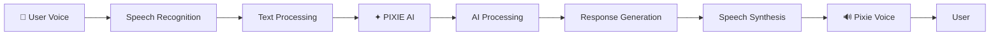

<div align="center">

# ✦ PIXIE AI ✦

### LISTEN • THINK • SPEAK

**Uma nova forma de interagir com Inteligência Artificial.**

<br>


<br>


<br>

> **THE FUTURE DOESN'T JUST ANSWER. IT LISTENS.**

</div>

---

## ✦ MEET PIXIE

**Pixie AI** é uma assistente virtual inteligente criada para transformar a maneira como pessoas interagem com Inteligência Artificial.

A Pixie foi projetada para criar uma experiência de conversa mais **natural, visual, inteligente e humanizada**.

Ela não foi criada apenas para receber comandos.

Ela foi criada para:

**OUVIR.**

**INTERPRETAR.**

**PENSAR.**

**RESPONDER.**

**FALAR.**

```text
              USER
                │
                ▼
         🎤 VOICE INPUT
                │
                ▼
      SPEECH RECOGNITION
                │
                ▼
          ✦ PIXIE AI ✦
                │
                ▼
       ARTIFICIAL INTELLIGENCE
                │
                ▼
       RESPONSE GENERATION
                │
                ▼
         SPEECH SYNTHESIS
                │
                ▼
          🔊 PIXIE VOICE
                │
                ▼
              USER
```

---

## ◈ THE EXPERIENCE

A Pixie combina **Inteligência Artificial, reconhecimento de voz, processamento de linguagem e síntese de fala** para criar uma experiência multimodal.

| TECHNOLOGY | FUNCTION |
|---|---|
| 🎤 Speech Recognition | Converte a voz do usuário em texto |
| 🧠 Artificial Intelligence | Interpreta e processa mensagens |
| 💬 Natural Conversation | Gera respostas contextualizadas |
| 🔊 Speech Synthesis | Transforma respostas em áudio |
| 🎭 Visual States | Representa os estados da Pixie |
| ⚡ Real-Time Interaction | Cria uma conversa dinâmica |

---

## ✦ CORE FEATURES

- 🎤 Interação por voz
- 💬 Chat inteligente
- 🧠 Inteligência Artificial Generativa
- 🔊 Respostas faladas
- 🇧🇷 Comunicação em português brasileiro
- ⚡ Interação em tempo real
- 🎭 Estados visuais da assistente
- 🌐 Interface web
- 📱 Arquitetura preparada para dispositivos móveis
- 🔐 Estrutura preparada para proteção de APIs

---

## ◉ PIXIE STATES

A Pixie possui diferentes estados de interação.

```text
┌───────────────────────────────────────┐
│                                       │
│   ✦ IDLE                              │
│                                       │
│   Pixie aguardando uma interação.     │
│                                       │
├───────────────────────────────────────┤
│                                       │
│   🎧 LISTENING                        │
│                                       │
│   Pixie ouvindo o usuário.            │
│                                       │
├───────────────────────────────────────┤
│                                       │
│   ◈ THINKING                          │
│                                       │
│   Pixie processando informações.      │
│                                       │
├───────────────────────────────────────┤
│                                       │
│   🔊 SPEAKING                         │
│                                       │
│   Pixie respondendo em áudio.         │
│                                       │
├───────────────────────────────────────┤
│                                       │
│   ✦ INTERACTING                       │
│                                       │
│   Pixie mantendo uma conversa ativa.  │
│                                       │
└───────────────────────────────────────┘
```

O objetivo é permitir que o usuário consiga **perceber visualmente o comportamento da Inteligência Artificial**.

---

## ◈ AI ARCHITECTURE



A arquitetura da Pixie é dividida em três camadas principais.

### INPUT LAYER

```text
VOICE
TEXT
MICROPHONE
USER INTERACTION
```

Responsável por receber as interações do usuário.

### INTELLIGENCE LAYER

```text
NATURAL LANGUAGE PROCESSING
CONTEXT INTERPRETATION
ARTIFICIAL INTELLIGENCE
RESPONSE GENERATION
```

Responsável pelo processamento inteligente das informações.

### OUTPUT LAYER

```text
TEXT RESPONSE
VOICE RESPONSE
VISUAL FEEDBACK
PIXIE STATES
```

Responsável pela comunicação da Pixie com o usuário.

---

## ✦ TECHNOLOGY STACK

<div align="center">


</div>

### ARTIFICIAL INTELLIGENCE

- Azure AI
- Generative AI
- Natural Language Processing
- Context Processing
- AI Response Generation

### VOICE TECHNOLOGY

- Speech Recognition
- Speech Synthesis
- Azure Speech
- Voice Interaction

### INTERFACE

- HTML5
- CSS3
- JavaScript

### DEVELOPMENT

- Python
- Git
- GitHub

---

## ◉ PROJECT STRUCTURE

```text
PIXIE-AI
│
├── assets
│   │
│   ├── pixie-banner.png
│   ├── pixie-idle.png
│   ├── pixie-listening.png
│   ├── pixie-thinking.png
│   └── pixie-speaking.png
│
├── chat.html
│
├── chat.js
│
├── style.css
│
├── app
│
├── .gitignore
│
└── README.md
```

---

## ✦ VOICE INTERACTION

O sistema de voz permite que o usuário converse diretamente com a Pixie.

```text
USER ACTIVATES MICROPHONE
            │
            ▼
PIXIE STARTS LISTENING
            │
            ▼
VOICE IS CAPTURED
            │
            ▼
SPEECH → TEXT
            │
            ▼
MESSAGE SENT TO AI
            │
            ▼
PIXIE PROCESSES MESSAGE
            │
            ▼
AI GENERATES RESPONSE
            │
            ▼
TEXT → SPEECH
            │
            ▼
PIXIE SPEAKS
```

O objetivo futuro é criar uma experiência de **conversa contínua por voz**, reduzindo a necessidade de interação manual.

---

## ◈ SECURITY

As credenciais utilizadas pelos serviços de Inteligência Artificial **nunca devem ser armazenadas publicamente no repositório**.

### NEVER PUBLISH

```text
AZURE_API_KEY

AZURE_SPEECH_KEY

API_KEY

SECRET_KEY

ACCESS_TOKEN

PRIVATE_KEY
```

Arquivos sensíveis devem ser protegidos.

### .GITIGNORE

```gitignore
.env
keys.json
*.env
__pycache__/
*.pyc
.vscode/
.DS_Store
```

> ⚠️ API KEYS MUST NEVER BE COMMITTED TO A PUBLIC REPOSITORY.

---

## ✦ PIXIE VISION

A visão da Pixie é evoluir de uma interface de chat para uma **assistente digital multimodal inteligente**.

```text
                 VOICE
                   +
                 VISION
                   +
                CONTEXT
                   +
                 MEMORY
                   +
              PERSONALITY
                   │
                   ▼
              ✦ PIXIE AI ✦
```

A Pixie está sendo projetada para compreender diferentes formas de interação humana.

---

## ◈ DEVELOPMENT ROADMAP

### ✦ PIXIE 0.1 — FOUNDATION

- [x] Interface de chat
- [x] Integração com Inteligência Artificial
- [x] Entrada de texto
- [x] Sistema inicial de respostas

### 🎤 PIXIE 0.2 — VOICE

- [x] Reconhecimento de voz
- [x] Conversão de voz em texto
- [x] Síntese de fala
- [x] Resposta em áudio

### 🎭 PIXIE 0.3 — VISUAL INTELLIGENCE

- [ ] Estados visuais dinâmicos
- [ ] Expressões da Pixie
- [ ] Animações sincronizadas com voz
- [ ] Feedback visual inteligente

### 🧠 PIXIE 0.4 — MEMORY

- [ ] Memória de conversas
- [ ] Contexto persistente
- [ ] Preferências do usuário
- [ ] Personalidade adaptativa

### 👁 PIXIE 0.5 — VISION

- [ ] Integração com câmera
- [ ] Reconhecimento de imagens
- [ ] Análise visual
- [ ] Interação multimodal

### ✦ PIXIE 1.0

- [ ] Aplicativo mobile
- [ ] Conversa contínua por voz
- [ ] Memória inteligente
- [ ] Visão computacional
- [ ] Personalidade dinâmica
- [ ] Ecossistema de integrações

---

## ◉ FUTURE INTEGRATIONS

```text
┌──────────────────┐
│     CALENDAR     │
├──────────────────┤
│      EMAIL       │
├──────────────────┤
│    SMART HOME    │
├──────────────────┤
│  NOTIFICATIONS   │
├──────────────────┤
│      CAMERA      │
├──────────────────┤
│      MUSIC       │
├──────────────────┤
│      WEATHER     │
├──────────────────┤
│       MAPS       │
├──────────────────┤
│      TASKS       │
├──────────────────┤
│  MOBILE DEVICES  │
└──────────────────┘
```

---

## ✦ PHILOSOPHY

> **Artificial Intelligence should not feel like a command line.**

> **It should feel like an interaction.**

A Pixie nasceu da ideia de criar uma experiência de Inteligência Artificial mais próxima da comunicação humana.

Uma assistente que não apenas responde.

Uma assistente que:

### ESCUTA.

### INTERPRETA.

### PENSA.

### FALA.

---

## ◈ CREATED BY

<div align="center">

### ✦ BRUNA RENATA ✦

**Creator & Developer of Pixie AI**

`CONCEPT`

`ARTIFICIAL INTELLIGENCE`

`PRODUCT VISION`

`DEVELOPMENT`

<br>

[](#)

</div>

---

<div align="center">

# ✦ PIXIE AI ✦

## LISTEN. THINK. SPEAK.

<br>

**BUILDING A MORE NATURAL WAY TO INTERACT WITH ARTIFICIAL INTELLIGENCE.**

<br>


<br>

`PIXIE AI • IN DEVELOPMENT`

<br>

### ✦ THE FUTURE DOESN'T JUST ANSWER. IT LISTENS. ✦

</div>
